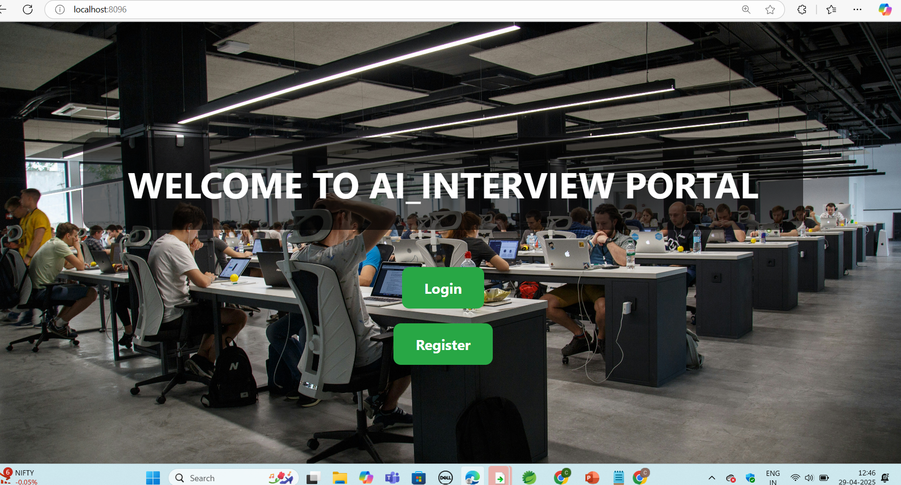
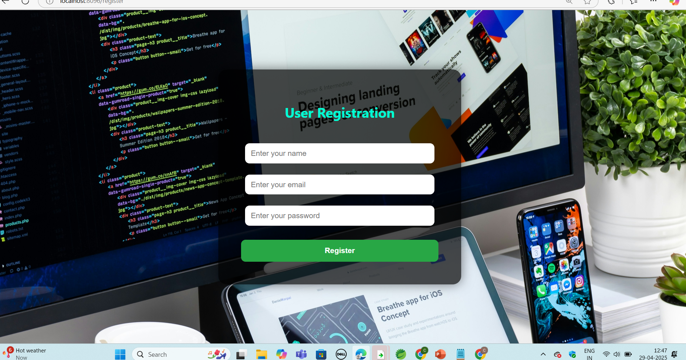
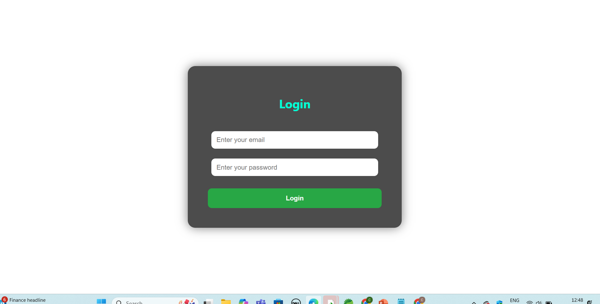
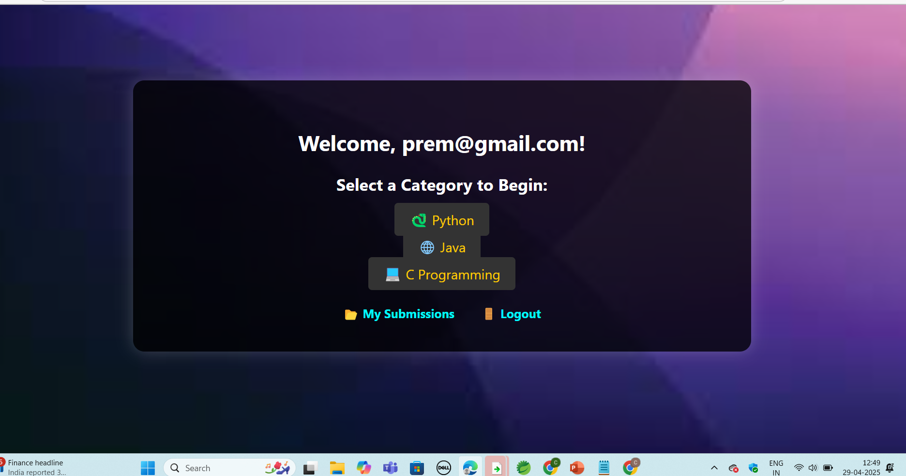
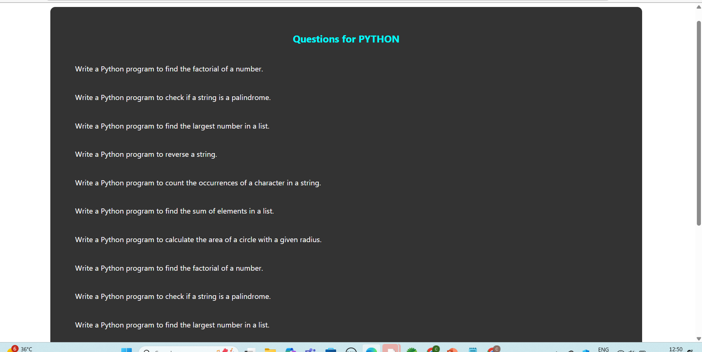
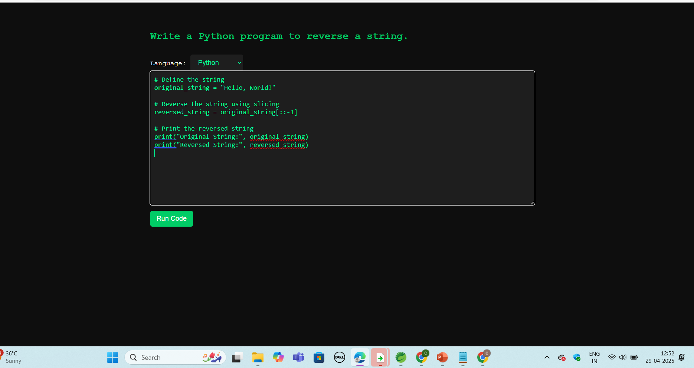
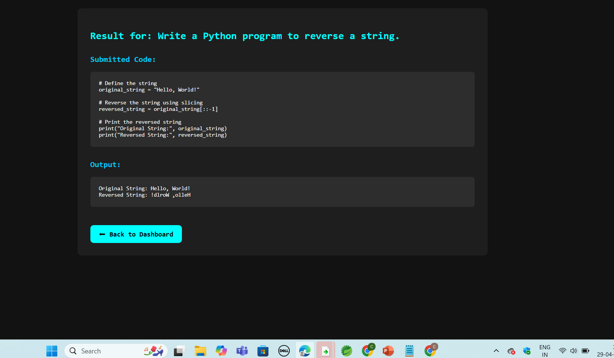
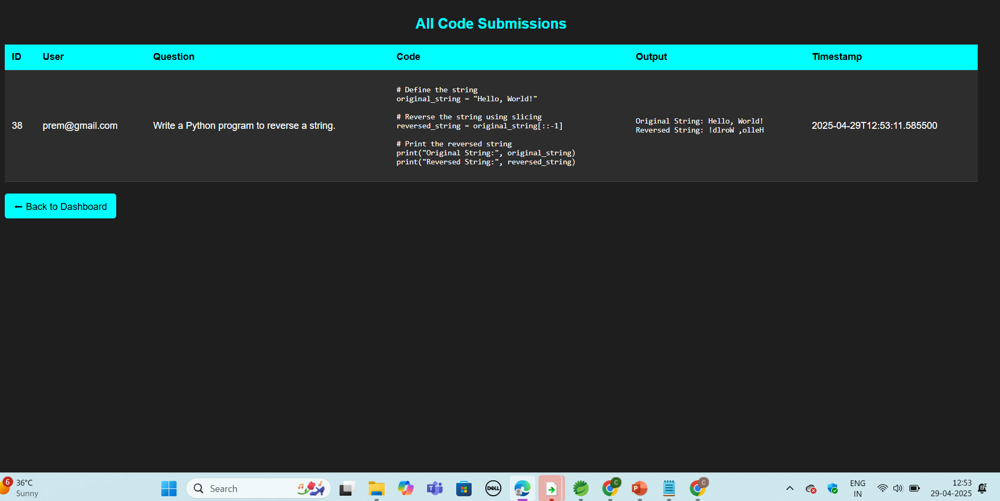

🚀 ##AI Powered Interview Preparation Portal**

A full‑stack Spring Boot 3 web application that simulates a real coding interview environment.

Users can:

- ✅ Register & login
- 🔎 Browse coding questions by category
- 💻 Write and execute code in an in‑browser editor
- ⚡ Run submissions via the JDoodle API
- 📄 View previous submissions in a history page

---

## 📌 Project Overview

- **Language:** Java 17
- **Framework:** Spring Boot 3 (Web / Data JPA / Security / Thymeleaf)
- **Frontend:** Thymeleaf templates
- **Security:** Spring Security + BCrypt
- **Database:** H2 (in‑memory for dev/testing)
- **Code Execution:** JDoodle external API

This project is ideal for interview preparation, academic use, or as a portfolio piece.

### 🧠 Key Features

- 🔐 Secure user authentication and registration
- 📂 Category‑based question browsing (Java, Python, C, …)
- 💻 Integrated code editor with live execution
- ⚙️ Remote code compilation and run via JDoodle
- 🗃️ Submission tracking per user
- 🧾 Embedded H2 database with console access

### 🏗️ Repository Structure

```text
AI_Powered_InterviewPrep/
│
├── AI interview preparation/
│   └── AI-Interview-Portal/   ← Main Spring Boot application (current folder)
│
├── AI interview-outputs/      ← Screenshots and demo images
├── Architecture-ai interview portal/
├── DOCS/
└── README.md
```

(Place your captured screenshots under `AI interview-outputs` or the `screenshots` subfolder.)

---

## 🖼️ Application Screenshots
## 🖼️ Application Screenshots

<div align="center">

### 🏠 Welcome Page


### 📝 User Registration


### 🔑 Login Page


### 📊 Dashboard


### 📂 Question Selection


### 💻 Coding Execution Page


### 📄 Session Result


### 🗂️ Submissions History


</div>

## ▶️ Run Locally (Windows)

1. **Build**

   ```bash
   # from project root (AI-Interview-Portal folder)
   ./mvnw.cmd clean package -DskipTests -q
   ```

2. **Run**

   ```bash
   java -jar target/AI-Interview-Portal-0.0.1-SNAPSHOT.jar
   ```

3. **Access**
   - Application: `http://localhost:8096`
   - H2 console: `http://localhost:8096/h2-console`
     - JDBC URL: `jdbc:h2:mem:interview`
     - Username: `SA` (password blank)

---

## 🗄️ Database Information

An H2 in‑memory SQL database is used during development.

- Lightweight and embedded
- Auto JPA schema generation (`create-drop`)
- Questions pre-loaded from `data.sql`

> ⚠ For production use, switch to MySQL/PostgreSQL by editing `application.properties`.

---

## ⚙️ JDoodle API Configuration

Edit `src/main/resources/application.properties` and add:

```properties
jdoodle.clientId=YOUR_CLIENT_ID
jdoodle.clientSecret=YOUR_CLIENT_SECRET
```

> 🔒 **Do not commit real credentials to GitHub.**

---

## 🔐 Security

- Passwords hashed with BCrypt
- Spring Security protects all routes except:
  - `/`
  - `/register`
  - `/login`
  - Static resources (`/css/**`, `/js/**`)

---

## 🔗 Main Endpoints

| Feature          | Endpoint                       |
|------------------|--------------------------------|
| Home             | `/`                            |
| Register         | `/register`                    |
| Login            | `/login`                       |
| Dashboard        | `/dashboard`                   |
| Questions        | `/questions?category=<cat>`    |
| Code Editor      | `/code-editor` (with params)   |
| Submit Code      | `POST /submit-code`            |
| Submissions      | `/submissions`                 |
| H2 Console       | `/h2-console`                  |

---

## 🎥 Demo Video

Project walkthrough: [Google Drive demo link](https://drive.google.com/file/d/1sydyOvpfI3hksrm22Ft-dos_gELkIqS1/view?usp=drive_link)

---

## 🚀 Future Improvements

- Multi‑language execution support
- Persistent database integration
- Role‑based access control (Admin/User)
- Dockerization
- CI/CD pipeline
- Cloud deployment

---

## 🤝 Contributing

1. Fork the repository
2. Create a feature branch
3. Commit your changes
4. Open a Pull Request

Please keep changes focused and document any new features.

---

## 📄 License

This project is created for educational and portfolio purposes. No license is attached; feel free to reuse code with attribution.

---

*Screenshot folder paths and file names should be adjusted depending on where you place the images (either `AI interview-outputs` or `screenshots`).*

